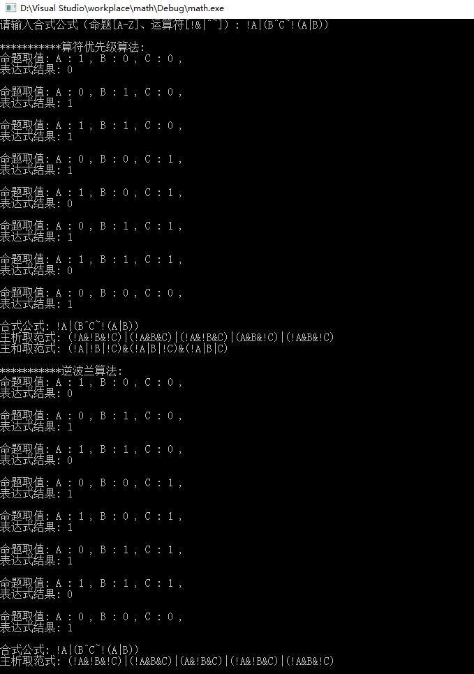

## 求合式公式的主析取、和取范式
> 基于 **算符优先级算法（移进规约)** 进行运算符计算，由于存在单目运算符，所以存在个性化改动
> 基于 **逆波兰（后缀）表达法** 进行运算符计算
### 运算符
- `!`:非
- `&`: 和取
- `|`：析取
- `^`:蕴含
- `~`:等价
- `( )`

### 命题

`A-Z大写字母`

### demo
- `A&B`
- `!A|(B^C~!(A|B))`
- `P^(P|(Q^P))`

